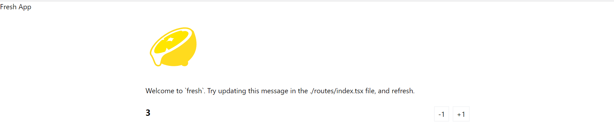

In this chapter of the Fresh documentation, you can find examples of features
that you may like in your Fresh project. If there's a specific example you'd
like to see here, please open
[a GitHub discussion](https://github.com/denoland/fresh/discussions/new?category=ideas).

### ```<Head /> ```

  We can use the ``` <Head /> ``` component in ```/runtime.ts``` to modify the ``` <head /> ``` element. For example:  
  ``` 
import { Head } from "$fresh/runtime.ts";
import Counter from "../islands/Counter.tsx";

export default function Home() {
  return (
    <>
      <Head>  
        <title>Fresh App</title>
        <p>Fresh App</p>
      </Head>
      <div class="p-4 mx-auto max-w-screen-md">
        
        <p class="my-6">
          Welcome to `fresh`. Try updating this message in the
          ./routes/index.tsx file, and refresh.
        </p>
        <Counter start={3 } />
        </div>
    </>
  );
}

```  
  
By adding changes to the inner components of ``` <Head /> ``` we can add a new  paragraph to the ``` <head /> ``` element of the display page. 
